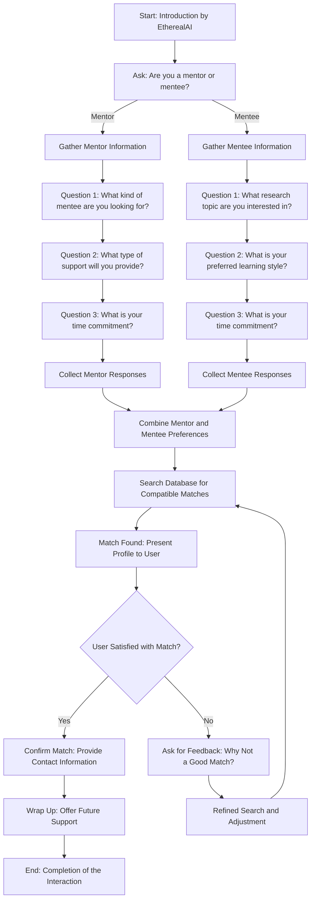

# Scenario 1 - Research Pair Implementation

## Explanation for the Diagram:

Start (A): The initial interaction starts with EtherealAI's introduction.
Ask: Mentor or Mentee? (B): The user is prompted to specify whether they are a mentor or mentee, and based on this, the workflow splits into two distinct branches.

Mentor Pathway:
Gather Mentor Information (C1): This path collects specific details from mentors.
Questions (D1, E1, F1): The mentor is asked about the type of mentee they want, the support they can offer, and their time commitment.
Collect Mentor Responses (G1): The responses are gathered to prepare for matching.

Mentee Pathway:
Gather Mentee Information (C2): This path collects specific details from mentees.
Questions (D2, E2, F2): The mentee is asked about their research interests, preferred learning style, and time commitment.
Collect Mentee Responses (G2): The responses are gathered similarly for preparation.

Combine Preferences (H): The gathered preferences from both pathways are combined to find matches.

Search for Matches (I): The system searches the database for compatible mentor-mentee pairings.

Present Match (J): A suitable match is presented.

User Satisfaction Check (K): The user validates if the match is suitable.

Provide Contact or Refine (L, M): If satisfied, the match is confirmed; otherwise, feedback is used to refine the search.

Feedback Loop (N): Unsuccessful matches lead to adjustments for better alignment.

Wrap Up (O): The conversation concludes with support for future queries.

End: The session is completed successfully.

### This diagram provides a clear depiction of branching paths based on user type (mentor or mentee), leading to the convergence during the match-making process.

