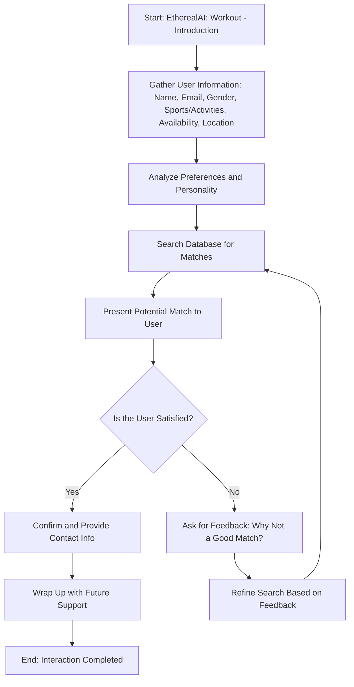

# Scenario 2 - Workout Buddy Pair Implementation

### Workflow Relevance and Implementation

#### Introduction by EtherealAI

- **Purpose**: Establishes the context and purpose of the app—helping users find compatible workout partners.
- **Implementation**: The AI introduces itself and explains its role in finding a match.

#### Gather User Information

- **Purpose**: A comprehensive profile is necessary to ensure accurate matches based on user preferences and availability.
- **Implementation**:
  - **Name and Email**: Identifies the user and facilitates communication.
  - **Gender and Same-Sex Preference**: Determines if the user wants a same-sex partner, refining the pool of potential matches.
  - **Activities**: Recognizes common sports or activities to match interests.
  - **Availability**: Aligns schedules to find compatible timing for both partners.
  - **Location**: Ensures proximity for ease of meeting and participation.

#### Analyze Preferences and Personality

- **Purpose**: Determines the best potential matches based on compatibility across different attributes.
- **Implementation**: The app assesses the collected data, focusing on overlapping interests, schedules, and locations.

#### Search Database and Present Matches

- **Purpose**: Identify potential partners who meet the user's preferences.
- **Implementation**:
  - The AI searches through existing profiles to find users with similar or complementary profiles.
  - Present potential matches with details, highlighting shared attributes.

#### User Decision Point

- **Purpose**: Involves the user in the decision-making process to ensure satisfaction.
- **Implementation**: 
  - Presents the match to the user and asks if it meets their expectations.
  - Encourages feedback to refine future suggestions if needed.

#### Feedback and Refinement

- **Purpose**: Allows continuous improvement in the matching process.
- **Implementation**:
  - Collects user feedback on the presented match.
  - Adjusts preferences or searches to improve future matches based on user input.

#### Wrap Up and Future Support

- **Purpose**: Concludes the session positively and offers ongoing assistance.
- **Implementation**: 
  - Confirms matches or acknowledges the need for further attempts.
  - Offers additional support and instructions for follow-up if needed.
    

