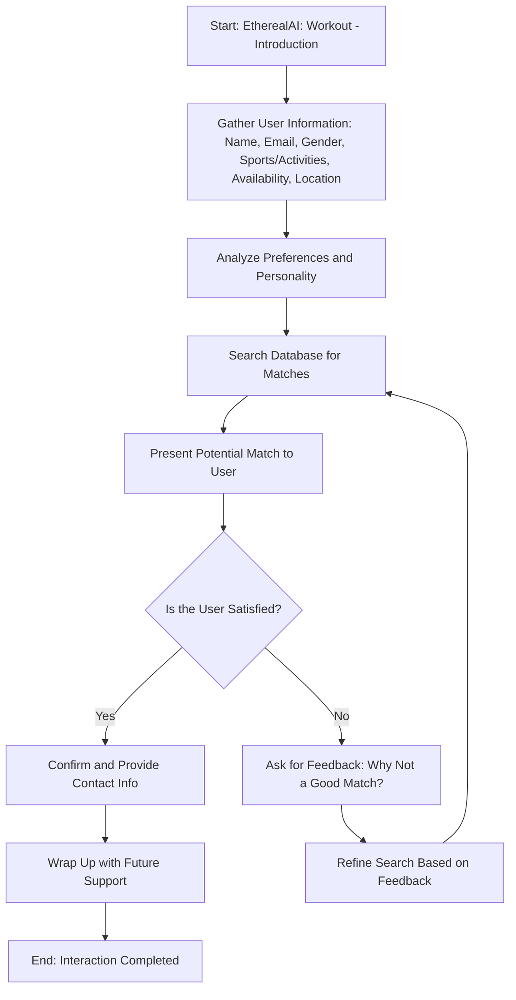

```mermaid
graph TD
  Start[Start: EtherealAI: Workout - Introduction] --> Gather[Gather User Information: Name, Email, Gender, Sports/Activities, Availability, Location]
  
  %% Information Gathering
  Gather --> Analysis[Analyze Preferences and Personality]
  
  %% Matching Process
  Analysis --> Search[Search Database for Matches]
  Search --> Present[Present Potential Match to User]
  
  %% User Decision
  Present --> Satisfied{Is the User Satisfied?}
  Satisfied -->|Yes| Confirm[Confirm and Provide Contact Info]
  Satisfied -->|No| Feedback[Ask for Feedback: Why Not a Good Match?]
  
  Feedback --> Refine[Refine Search Based on Feedback]
  Refine --> Search
  
  %% Wrap Up
  Confirm --> Wrap[Wrap Up with Future Support]
  Wrap --> End[End: Interaction Completed]
```
