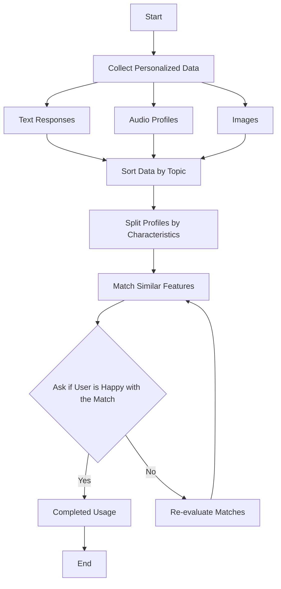

# Creating a Workflow - How does EtheralAI work?

### Explanation:
Below is an explanation of the workflow that EtheralAI operates on. This can be applied to both general situations, as well as specific situations as we see in our 6 prompts as the algorithm matches users. In a few of the implementation and testing of the workflow, we can see how certain inputs can make the model more complicated or more simplistic depending on what kind of match the user is looking for.

- **Start**: The beginning of the workflow.
- **Collect Personalized Data**: Data collection is done through text responses, audio profiles, and images.
- **Sort Data by Topic**: The collected data is organized and categorized according to the relevant topics and themes to facilitate processing.
- **Split Profiles by Characteristics**: Based on the sorted topics, the profiles are broken down further by individual characteristics to create groups or segments.
- **Match Similar Features**: The system identifies similarities across different profiles based on shared features or characteristics.
- **Ask if User is Happy with the Match**: The user is prompted to review the matches. If satisfied, the process continues to completion.
- **Re-evaluate Matches**: If the user is not satisfied, the system goes back to re-evaluate and refine the matches.
- **Completed Usage**: Represents the successful conclusion of the process after the user confirms satisfaction with the matches.
- **End**: Marks the end of the workflow once the process is completed.