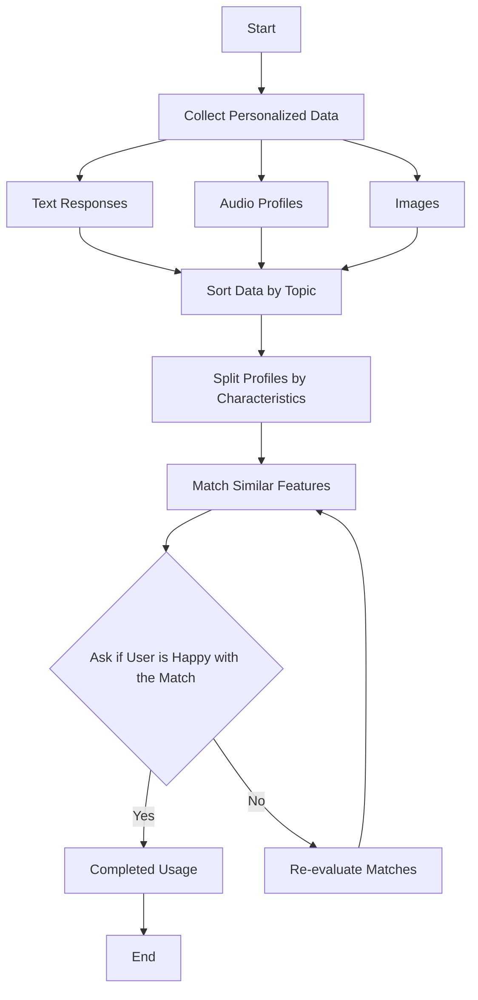

# comm4190_F25_FinalProject

Final Project Idea - A compatability appliation of an LLM that utilizes personal survey data, audio files, and transcriptions to match people for a variety of purposes whether romantically, platonically, professionally, or actively.

### Angelica Scenarios
- Scenario 1: Mentor mentee research pairing
- Scenario 2: Exercise buddy

### Dante Scenarios:
- Scenario 3: Job match
- Scenario 4: College roommate match

### Helen Scenarios
- Scenario 5: Study buddy
- Scneario 6: Content recommendation

## Prompting
As we experimented with prompting our specific scenarios, we noticed the importance of finetuning prompts - specficially with regards to adding constraints and pushing for detailed input information which was necessary to create a profile for each user. Additionally, we updated our prompts to alter the voice and ouput response depending on the needs/wants of the user.

## General Workflow Diagram
